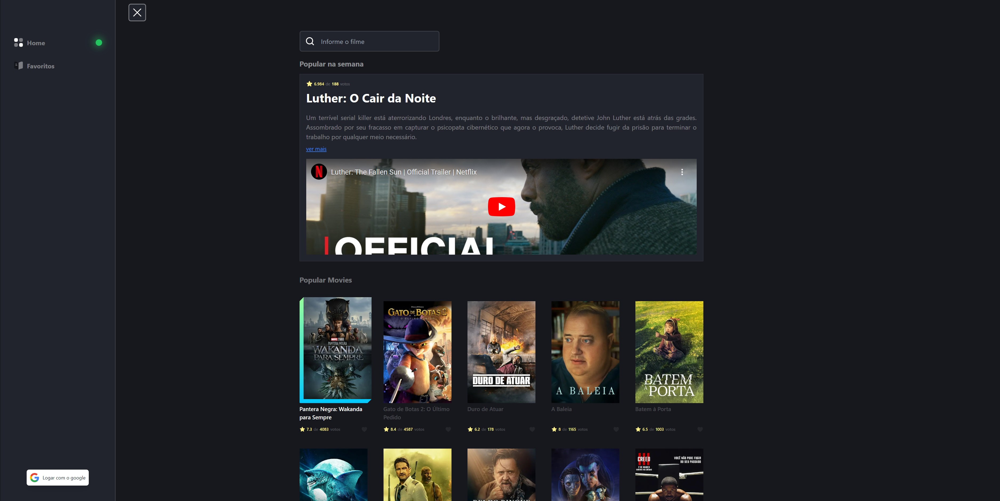

# Movie.io - Projeto Next.js

    Este é um projeto desenvolvido para portifólio e estudo do Next.js

## Sobre o projeto

O Next.js é uma ferramenta fantastica que possibilita utilizarmos rotas como qual utilizamos no backend, nesse projeto eu quis justamente focar meus esforços nessa caracteristica, então meu objetivo foi consumir dados de diferentes formas.

Primeiramente o projeto consome a **API do TMDB** para fazer a listagem de filmes, com isso o usuário já está habilitado a ver os filmes populares como também, pesquisar por filmes.

Caso o usuário queira adicionar um filme ao favorito ele pode se autenticar através do **next-auth** utilizando o provider do Google. Os dados do usuário autenticado serão salvos então em um base dados feito com **Prisma**, assim o usuário poderá começar a adicionar os filmes aos favoritos, que também estarão sendo salvos no banco de dados.

## Tecnologias utilizadas

   - Next.js
   - Next Auth
   - Prisma
   - Zod
   - Nprogress
   - Axios
   - Frammer Motion

## Agradecimentos

Foi um projeto muito divertido e com muitos aprendizados, ao todo fiquei muito grato de poder desenvolver, coloque muito carinho ❤ nele.